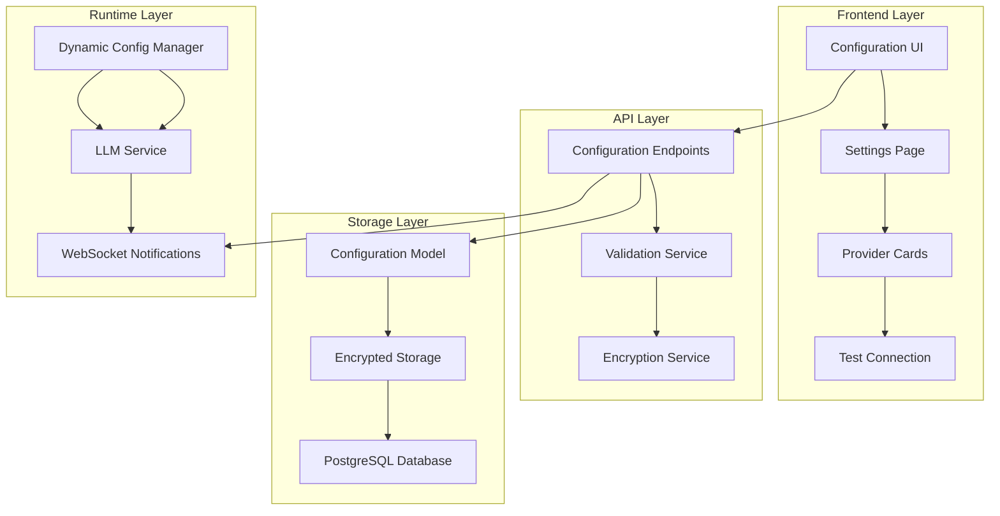

# Design Document: Frontend API Key Management

## Overview

This design implements a comprehensive frontend-based configuration system for Kodiak's LLM providers, allowing users to manage API keys and settings through the web interface without requiring Docker rebuilds or manual file editing. The system provides secure storage, real-time updates, and backward compatibility with existing environment-based configuration.

## Architecture

The solution follows a layered architecture with clear separation between frontend UI, backend API, secure storage, and configuration management:



## Components and Interfaces

### 1. Database Schema Extension

Add a new `LLMConfiguration` model to store encrypted API keys and provider settings:

```python
class LLMConfiguration(SQLModel, table=True):
    id: UUID = Field(default_factory=uuid4, primary_key=True)
    provider: str = Field(index=True)  # "gemini", "openai", "claude"
    model: str  # "gemini/gemini-1.5-pro"
    api_key_encrypted: str  # Encrypted API key
    base_url: Optional[str] = None
    temperature: float = Field(default=0.1)
    max_tokens: int = Field(default=4096)
    is_active: bool = Field(default=False)  # Only one can be active
    created_at: datetime = Field(default_factory=datetime.utcnow)
    updated_at: datetime = Field(default_factory=datetime.utcnow)
```

### 2. Backend API Endpoints

Create new endpoints in `kodiak/api/endpoints/configuration.py`:

```python
# GET /api/v1/config/llm - Get all LLM configurations (keys masked)
# POST /api/v1/config/llm - Create new LLM configuration
# PUT /api/v1/config/llm/{provider} - Update existing configuration
# DELETE /api/v1/config/llm/{provider} - Delete configuration
# POST /api/v1/config/llm/{provider}/test - Test connection
# POST /api/v1/config/llm/{provider}/activate - Set as active provider
# GET /api/v1/config/llm/presets - Get available model presets
# POST /api/v1/config/llm/import - Import configuration from file
# GET /api/v1/config/llm/export - Export configuration (keys excluded)
```

### 3. Configuration Service

Extend the existing configuration system with dynamic updates:

```python
class DynamicConfigManager:
    def __init__(self):
        self.db_config: Optional[LLMConfiguration] = None
        self.env_config = settings  # Fallback to environment
    
    async def get_active_config(self) -> Dict[str, Any]:
        """Get the currently active LLM configuration"""
    
    async def update_active_config(self, provider: str) -> None:
        """Switch to a different provider configuration"""
    
    async def validate_config(self, config: Dict[str, Any]) -> bool:
        """Test API connection with given configuration"""
```

### 4. Encryption Service

Implement secure API key storage using Fernet encryption:

```python
class ConfigurationEncryption:
    def __init__(self, key: bytes):
        self.cipher = Fernet(key)
    
    def encrypt_api_key(self, api_key: str) -> str:
        """Encrypt API key for database storage"""
    
    def decrypt_api_key(self, encrypted_key: str) -> str:
        """Decrypt API key for use"""
```

### 5. Frontend Configuration UI

Create a new settings page with provider management:

```typescript
// components/ConfigurationPage.tsx
interface LLMProvider {
  name: string;
  provider: string;
  model: string;
  apiKey: string;
  isActive: boolean;
  isConfigured: boolean;
  status: 'connected' | 'error' | 'testing' | 'unconfigured';
}

// Key components:
// - ProviderCard: Individual provider configuration
// - TestConnection: API key validation
// - ConfigurationWizard: First-time setup
// - ImportExport: Configuration management
```

## Data Models

### LLM Configuration Model

```python
class LLMConfiguration(SQLModel, table=True):
    """Stores encrypted LLM provider configurations"""
    id: UUID = Field(default_factory=uuid4, primary_key=True)
    provider: str = Field(index=True)  # LLMProvider enum value
    display_name: str  # "Google Gemini", "OpenAI GPT-4"
    model: str  # Full model identifier
    api_key_encrypted: str  # Fernet-encrypted API key
    base_url: Optional[str] = None  # Custom API endpoint
    temperature: float = Field(default=0.1, ge=0.0, le=2.0)
    max_tokens: int = Field(default=4096, gt=0)
    timeout: int = Field(default=30, gt=0)  # Request timeout
    is_active: bool = Field(default=False)  # Only one active at a time
    is_enabled: bool = Field(default=True)  # Can be disabled
    metadata: Dict[str, Any] = Field(default={}, sa_column=Column(JSON))
    created_at: datetime = Field(default_factory=datetime.utcnow)
    updated_at: datetime = Field(default_factory=datetime.utcnow)
```

### Configuration Response Models

```python
class LLMConfigurationResponse(BaseModel):
    """API response model (excludes sensitive data)"""
    id: UUID
    provider: str
    display_name: str
    model: str
    has_api_key: bool  # Boolean flag instead of actual key
    base_url: Optional[str]
    temperature: float
    max_tokens: int
    timeout: int
    is_active: bool
    is_enabled: bool
    status: str  # "connected", "error", "unconfigured"
    last_tested: Optional[datetime]
    created_at: datetime
    updated_at: datetime

class LLMConfigurationCreate(BaseModel):
    """Request model for creating configuration"""
    provider: str
    model: str
    api_key: str
    base_url: Optional[str] = None
    temperature: float = 0.1
    max_tokens: int = 4096
    timeout: int = 30

class LLMConfigurationUpdate(BaseModel):
    """Request model for updating configuration"""
    model: Optional[str] = None
    api_key: Optional[str] = None
    base_url: Optional[str] = None
    temperature: Optional[float] = None
    max_tokens: Optional[int] = None
    timeout: Optional[int] = None
    is_enabled: Optional[bool] = None
```

## Correctness Properties

*A property is a characteristic or behavior that should hold true across all valid executions of a system-essentially, a formal statement about what the system should do. Properties serve as the bridge between human-readable specifications and machine-verifiable correctness guarantees.*

Based on the prework analysis, the following properties have been identified for testing:

### Property 1: API Key Format Validation
*For any* string input as an API key, the validation system should accept only strings that match the expected format patterns for each provider (OpenAI: sk-*, Gemini: AI*, Claude: sk-ant-*)
**Validates: Requirements 1.2**

### Property 2: Configuration Storage and Application
*For any* valid LLM configuration, when saved through the UI, the system should store it in the database and immediately make it available to the LLM service
**Validates: Requirements 1.3**

### Property 3: Invalid Configuration Rejection
*For any* invalid configuration input, the system should reject it with descriptive error messages and prevent database storage
**Validates: Requirements 1.4**

### Property 4: Provider Switching Consistency
*For any* provider switch request, if the target provider has valid configuration, the system should immediately update the active provider for all new LLM requests
**Validates: Requirements 2.1**

### Property 5: Provider Switch Validation
*For any* provider switch attempt, the system should validate the target provider's configuration before switching and maintain the current provider if validation fails
**Validates: Requirements 2.2, 2.3**

### Property 6: Agent Configuration Notification
*For any* configuration update, the system should notify all active agents to use the new configuration for subsequent requests
**Validates: Requirements 2.4**

### Property 7: Single Active Provider Invariant
*For any* system state, exactly one LLM provider should be marked as active, regardless of how many providers are configured
**Validates: Requirements 2.5**

### Property 8: API Key Encryption
*For any* API key saved to the database, it should be encrypted using Fernet encryption and never stored in plaintext
**Validates: Requirements 3.1**

### Property 9: Secure API Key Access
*For any* API key retrieval, the system should decrypt keys only when needed for LLM requests and never expose them in API responses or logs
**Validates: Requirements 3.2, 3.3**

### Property 10: Export Security
*For any* configuration export operation, the resulting data should exclude or mask all sensitive API keys while preserving other settings
**Validates: Requirements 3.4**

### Property 11: Connection Test Validation
*For any* "Test Connection" request, the system should make a minimal API call to validate the configuration and return appropriate success or failure details
**Validates: Requirements 4.1, 4.2, 4.3**

### Property 12: Pre-test Validation
*For any* connection test attempt, the system should validate API key format and required parameters before making external API calls
**Validates: Requirements 4.4**

### Property 13: Environment Variable Migration
*For any* system startup with existing environment variables, those variables should be automatically imported into database configuration if no database config exists
**Validates: Requirements 5.1**

### Property 14: Configuration Precedence
*For any* system state where both environment and database configurations exist, the database configuration should take precedence for all LLM operations
**Validates: Requirements 5.2**

### Property 15: Environment Fallback
*For any* system state where database configuration is missing, the system should fall back to environment variables as the configuration source
**Validates: Requirements 5.4**

### Property 16: CLI Compatibility
*For any* configuration created by the existing configure_llm.py script, it should work seamlessly with the new frontend configuration system
**Validates: Requirements 5.5**

### Property 17: Real-time Configuration Sync
*For any* configuration update in one browser session, all connected WebSocket clients should receive the update and refresh their UI accordingly
**Validates: Requirements 6.1, 6.2**

### Property 18: Concurrent Update Safety
*For any* concurrent configuration updates from multiple sources, the system should handle them gracefully without data corruption
**Validates: Requirements 6.4**

### Property 19: Configuration Export Completeness
*For any* configuration export, the resulting JSON should include all provider settings, model preferences, and timeout configurations while excluding sensitive API keys
**Validates: Requirements 7.1, 7.3**

### Property 20: Import Validation and Merging
*For any* configuration import operation, the system should validate the file format, prompt for missing API keys, and merge settings with existing configuration while highlighting conflicts
**Validates: Requirements 7.2, 7.4**

<function_calls>
<invoke name="prework">
<parameter name="featureName">frontend-api-key-management

## Error Handling

### Configuration Validation Errors
- **Invalid API Key Format**: Return specific format requirements for each provider
- **Missing Required Fields**: Identify which fields are required for each provider
- **Duplicate Provider**: Prevent multiple configurations for the same provider
- **Database Connection Errors**: Graceful fallback to environment variables

### API Connection Test Errors
- **Authentication Failures**: Clear messaging about invalid API keys
- **Network Timeouts**: Distinguish between network and API issues
- **Rate Limiting**: Inform users about API quota limitations
- **Service Unavailable**: Handle provider service outages gracefully

### Encryption/Decryption Errors
- **Key Corruption**: Detect and handle corrupted encryption keys
- **Missing Encryption Key**: Generate new encryption key if missing
- **Decryption Failures**: Log security events and require re-authentication

### Concurrent Access Errors
- **Configuration Conflicts**: Handle simultaneous updates with optimistic locking
- **WebSocket Disconnections**: Queue updates for disconnected clients
- **Database Deadlocks**: Retry logic with exponential backoff

## Testing Strategy

### Unit Testing Approach
- **Configuration CRUD Operations**: Test create, read, update, delete operations
- **Encryption/Decryption**: Verify secure key handling
- **API Key Validation**: Test format validation for all providers
- **Migration Logic**: Test environment variable import
- **Export/Import Functions**: Test configuration serialization

### Property-Based Testing Configuration
- **Framework**: Use pytest with Hypothesis for Python backend testing
- **Test Iterations**: Minimum 100 iterations per property test
- **Input Generation**: Custom generators for API keys, configurations, and provider data
- **Property Test Tags**: Each test references its design document property

**Property Test Examples**:
```python
# Feature: frontend-api-key-management, Property 1: API Key Format Validation
@given(api_key=text(), provider=sampled_from(['openai', 'gemini', 'claude']))
def test_api_key_validation_property(api_key, provider):
    result = validate_api_key_format(api_key, provider)
    expected = matches_provider_format(api_key, provider)
    assert result == expected

# Feature: frontend-api-key-management, Property 8: API Key Encryption
@given(api_key=valid_api_key())
def test_api_key_encryption_property(api_key):
    encrypted = encrypt_api_key(api_key)
    assert encrypted != api_key  # Never store plaintext
    assert decrypt_api_key(encrypted) == api_key  # Round-trip works
```

### Integration Testing
- **End-to-End Configuration Flow**: Test complete user workflow from UI to database
- **WebSocket Real-time Updates**: Verify configuration changes propagate to all clients
- **LLM Service Integration**: Test that configuration changes affect actual LLM requests
- **Migration Testing**: Test upgrade scenarios with existing environment configurations

### Frontend Testing
- **Component Testing**: Test individual configuration UI components
- **User Interaction Testing**: Test form validation and submission flows
- **WebSocket Integration**: Test real-time configuration updates in UI
- **Error State Testing**: Test UI behavior with various error conditions

The testing strategy ensures both specific examples work correctly (unit tests) and universal properties hold across all inputs (property-based tests), providing comprehensive coverage of the configuration management system.