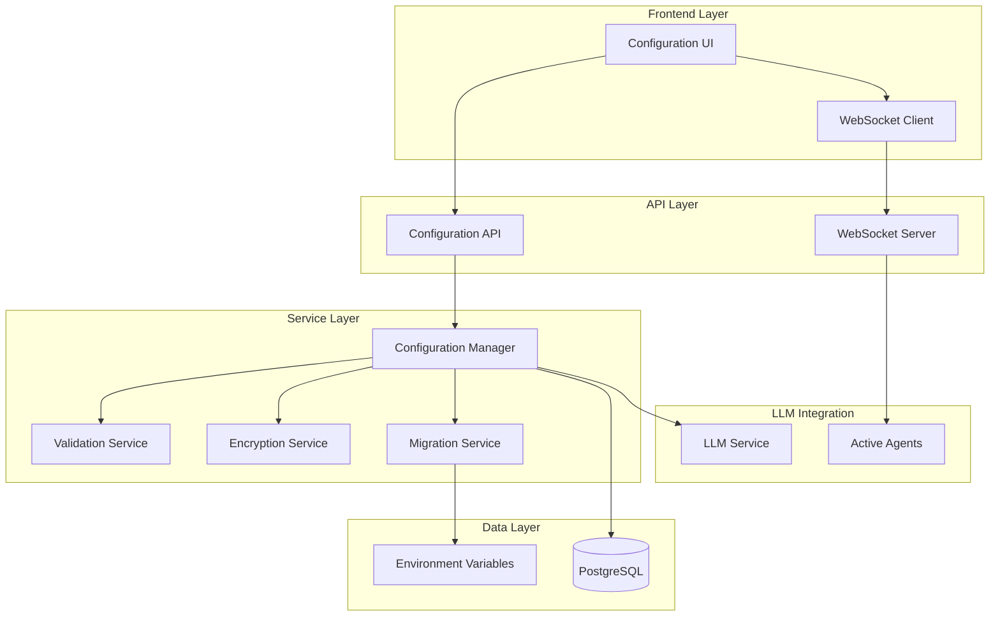

# Design Document: Frontend API Key Management

## Overview

This design implements a comprehensive frontend-based configuration system for Kodiak's LLM providers, enabling users to manage API keys and settings through the web interface without requiring Docker rebuilds or manual file editing. The system provides secure storage with encryption, real-time updates via WebSocket, dynamic provider switching, and maintains backward compatibility with existing environment-based configuration.

The architecture extends Kodiak's existing configuration system (`kodiak/core/config.py`) and database models (`kodiak/database/models.py`) while integrating with the current WebSocket infrastructure (`kodiak/api/events.py`) for real-time updates.

## Architecture

### High-Level Architecture



### Data Flow

1. **Configuration Updates**: Frontend → API → Configuration Manager → Database → LLM Service
2. **Real-time Sync**: Configuration Manager → WebSocket → All Connected Clients
3. **Agent Notifications**: Configuration Manager → Event System → Active Agents
4. **Migration**: Environment Variables → Migration Service → Database
5. **Validation**: User Input → Validation Service → API Key Testing → Provider APIs

## Components and Interfaces

### Database Models

**LLMConfiguration Model** (extends `kodiak/database/models.py`):
```python
class LLMConfiguration(SQLModel, table=True):
    id: UUID = Field(default_factory=uuid4, primary_key=True)
    provider: str = Field(index=True)  # "gemini", "openai", "claude", etc.
    model: str  # "gemini/gemini-1.5-pro", "openai/gpt-4", etc.
    
    # Encrypted API key
    encrypted_api_key: Optional[str] = None
    
    # Additional settings
    temperature: float = Field(default=0.1)
    max_tokens: int = Field(default=4096)
    base_url: Optional[str] = None
    timeout: int = Field(default=30)
    
    # Status and metadata
    is_active: bool = Field(default=False)  # Only one can be active
    is_valid: bool = Field(default=False)   # Last validation result
    last_tested: Optional[datetime] = None
    test_error: Optional[str] = None
    
    # Audit fields
    created_at: datetime = Field(default_factory=datetime.utcnow)
    updated_at: datetime = Field(default_factory=datetime.utcnow)
    created_by: Optional[str] = None  # Future: user management
    
    # Configuration metadata
    display_name: Optional[str] = None
    description: Optional[str] = None
    tags: List[str] = Field(default=[], sa_column=Column(JSON))
```

### Core Services

**ConfigurationEncryption Service**:
```python
class ConfigurationEncryption:
    """Handles secure encryption/decryption of API keys"""
    
    def encrypt_api_key(self, api_key: str) -> str:
        """Encrypt API key using Fernet symmetric encryption"""
    
    def decrypt_api_key(self, encrypted_key: str) -> str:
        """Decrypt API key for LLM requests only"""
    
    def generate_encryption_key(self) -> bytes:
        """Generate new encryption key (for initial setup)"""
```

**DynamicConfigManager Service**:
```python
class DynamicConfigManager:
    """Manages runtime configuration switching and validation"""
    
    async def get_active_configuration(self) -> LLMConfiguration:
        """Get currently active LLM configuration"""
    
    async def switch_provider(self, provider_id: UUID) -> bool:
        """Switch to different provider with validation"""
    
    async def validate_configuration(self, config: LLMConfiguration) -> ValidationResult:
        """Validate configuration without saving"""
    
    async def test_connection(self, config: LLMConfiguration) -> TestResult:
        """Test API connection with minimal usage"""
    
    async def notify_agents(self, config_change: ConfigurationChange):
        """Notify all active agents of configuration changes"""
```

**ValidationService**:
```python
class ValidationService:
    """Validates API keys and configuration parameters"""
    
    def validate_api_key_format(self, provider: str, api_key: str) -> bool:
        """Validate API key format for specific provider"""
    
    def validate_model_compatibility(self, provider: str, model: str) -> bool:
        """Validate model is compatible with provider"""
    
    async def test_api_connection(self, config: LLMConfiguration) -> TestResult:
        """Make minimal test API call"""
```

### API Endpoints

**Configuration CRUD API** (`/api/v1/configuration/`):
- `GET /configurations` - List all configurations
- `POST /configurations` - Create new configuration
- `PUT /configurations/{id}` - Update configuration
- `DELETE /configurations/{id}` - Delete configuration
- `POST /configurations/{id}/test` - Test configuration
- `POST /configurations/{id}/activate` - Set as active provider
- `GET /configurations/active` - Get active configuration
- `POST /configurations/import` - Import configuration file
- `GET /configurations/export` - Export configurations

**Migration API** (`/api/v1/configuration/migration/`):
- `POST /migration/import-env` - Import from environment variables
- `POST /migration/import-file` - Import from .env file
- `GET /migration/status` - Check migration status

### Frontend Components

**Configuration Page Structure**:
```typescript
interface ConfigurationPageProps {
  configurations: LLMConfiguration[]
  activeConfiguration: LLMConfiguration | null
  isLoading: boolean
}

// Main components:
// - ProviderCard: Display provider status and controls
// - ConfigurationForm: Add/edit configuration
// - TestConnectionButton: Validate configuration
// - SetupWizard: First-time configuration guide
// - ImportExportPanel: Configuration management
```

**WebSocket Integration**:
```typescript
interface ConfigurationWebSocketEvents {
  'configuration_updated': ConfigurationUpdateEvent
  'provider_switched': ProviderSwitchEvent
  'test_completed': TestResultEvent
  'validation_error': ValidationErrorEvent
}
```

## Data Models

### Configuration Data Structure

```typescript
interface LLMConfiguration {
  id: string
  provider: 'gemini' | 'openai' | 'claude' | 'ollama' | 'azure'
  model: string
  displayName?: string
  description?: string
  
  // Settings
  temperature: number
  maxTokens: number
  baseUrl?: string
  timeout: number
  
  // Status
  isActive: boolean
  isValid: boolean
  lastTested?: Date
  testError?: string
  
  // Metadata
  createdAt: Date
  updatedAt: Date
  tags: string[]
}

interface ValidationResult {
  isValid: boolean
  errors: ValidationError[]
  warnings: ValidationWarning[]
}

interface TestResult {
  success: boolean
  modelInfo?: {
    name: string
    version: string
    capabilities: string[]
  }
  error?: {
    type: 'authentication' | 'network' | 'quota' | 'invalid_model'
    message: string
    details?: any
  }
  responseTime: number
  timestamp: Date
}
```

### Migration Data Structure

```typescript
interface MigrationResult {
  success: boolean
  imported: LLMConfiguration[]
  skipped: string[]
  errors: MigrationError[]
}

interface EnvironmentMapping {
  'GOOGLE_API_KEY': { provider: 'gemini', model: 'gemini/gemini-1.5-pro' }
  'OPENAI_API_KEY': { provider: 'openai', model: 'openai/gpt-4' }
  'ANTHROPIC_API_KEY': { provider: 'claude', model: 'claude-3-5-sonnet-20241022' }
}
```

## Correctness Properties

*A property is a characteristic or behavior that should hold true across all valid executions of a system-essentially, a formal statement about what the system should do. Properties serve as the bridge between human-readable specifications and machine-verifiable correctness guarantees.*

### Property 1: API Key Format Validation
*For any* LLM provider and API key string, the validation service should accept only strings that match the provider's expected API key format and reject all others.
**Validates: Requirements 1.2**

### Property 2: Configuration Storage and Application
*For any* valid LLM configuration, when saved through the system, it should be persisted in the database and immediately applied to the LLM service for new requests.
**Validates: Requirements 1.3**

### Property 3: Invalid Configuration Rejection
*For any* invalid LLM configuration submitted through the UI, the system should reject it with descriptive error messages and prevent saving to the database.
**Validates: Requirements 1.4**

### Property 4: Provider Switching Consistency
*For any* valid provider switch request, the system should immediately update the active provider and ensure all subsequent LLM requests use the new configuration.
**Validates: Requirements 2.1**

### Property 5: Provider Switch Validation
*For any* provider switch attempt, the system should validate the target provider's configuration before switching and maintain the current provider if validation fails.
**Validates: Requirements 2.2, 2.3**

### Property 6: Agent Configuration Notification
*For any* configuration change, the system should notify all active agents so they use the updated configuration for subsequent requests.
**Validates: Requirements 2.4**

### Property 7: Single Active Provider Invariant
*For any* system state, exactly one LLM provider should be marked as active, even when multiple providers are configured.
**Validates: Requirements 2.5**

### Property 8: API Key Encryption
*For any* API key saved to the database, it should be encrypted before storage and never stored in plain text.
**Validates: Requirements 3.1**

### Property 9: Secure API Key Access
*For any* API key retrieval, decryption should only occur when needed for LLM requests and never for display or logging purposes.
**Validates: Requirements 3.2, 3.3**

### Property 10: Export Security
*For any* configuration export operation, the resulting file should exclude or mask all sensitive API keys while preserving other configuration data.
**Validates: Requirements 3.4**

### Property 11: Connection Test Validation
*For any* connection test request, the system should make a minimal API call to the provider and return appropriate success or failure information.
**Validates: Requirements 4.1, 4.2, 4.3**

### Property 12: Pre-test Validation
*For any* connection test attempt, the system should validate API key format and required parameters before making external API calls.
**Validates: Requirements 4.4**

### Property 13: Environment Variable Migration
*For any* system startup with existing environment variables, those variables should be automatically imported into database configuration if no database configuration exists.
**Validates: Requirements 5.1**

### Property 14: Configuration Precedence
*For any* system state where both environment and database configurations exist, database configuration should take precedence over environment variables.
**Validates: Requirements 5.2**

### Property 15: Environment Fallback
*For any* system state where database configuration is missing, the system should fall back to environment variables as a secondary configuration source.
**Validates: Requirements 5.4**

### Property 16: CLI Compatibility
*For any* configuration created through the existing configure_llm.py script, it should continue to work and be compatible with the new database-based system.
**Validates: Requirements 5.5**

### Property 17: Real-time Configuration Sync
*For any* configuration update in one browser session, all connected WebSocket clients should receive the update and refresh their UI to show current values.
**Validates: Requirements 6.1, 6.2**

### Property 18: Concurrent Update Safety
*For any* concurrent configuration updates, the system should handle them gracefully without data corruption, using appropriate locking mechanisms.
**Validates: Requirements 6.4**

### Property 19: Configuration Export Completeness
*For any* configuration export, the resulting JSON should include all provider settings, model preferences, and timeout configurations while excluding sensitive data.
**Validates: Requirements 7.1, 7.3**

### Property 20: Import Validation and Merging
*For any* configuration import operation, the system should validate the file format, prompt for missing API keys, and merge settings with existing configuration while highlighting conflicts.
**Validates: Requirements 7.2, 7.4**

## Error Handling

### Error Categories

1. **Validation Errors**:
   - Invalid API key format
   - Unsupported model for provider
   - Missing required parameters
   - Invalid configuration values

2. **Authentication Errors**:
   - Invalid API key
   - Expired API key
   - Insufficient permissions
   - Rate limit exceeded

3. **Network Errors**:
   - Connection timeout
   - DNS resolution failure
   - SSL/TLS errors
   - Provider service unavailable

4. **System Errors**:
   - Database connection failure
   - Encryption/decryption errors
   - WebSocket connection issues
   - Concurrent update conflicts

### Error Response Format

```typescript
interface ErrorResponse {
  error: {
    code: string
    message: string
    details?: any
    timestamp: Date
    requestId: string
  }
  suggestions?: string[]
  documentation?: string
}
```

### Error Recovery Strategies

1. **Graceful Degradation**: Fall back to environment variables if database configuration fails
2. **Retry Logic**: Automatic retry for transient network errors
3. **User Guidance**: Provide specific error messages and resolution steps
4. **Rollback**: Revert to previous working configuration on critical failures

## Testing Strategy

### Dual Testing Approach

The system requires both unit tests and property-based tests for comprehensive coverage:

**Unit Tests**:
- Specific examples of valid/invalid configurations
- Edge cases like empty databases, missing environment variables
- Integration points between components
- Error conditions and recovery scenarios

**Property-Based Tests**:
- Universal properties that hold across all inputs
- Configuration validation across all provider types
- Encryption/decryption round-trip testing
- Concurrent update safety verification

### Property-Based Testing Configuration

- **Framework**: Use `hypothesis` for Python property-based testing
- **Iterations**: Minimum 100 iterations per property test
- **Test Tags**: Each property test must reference its design document property
- **Tag Format**: `# Feature: frontend-api-key-management, Property {number}: {property_text}`

### Test Data Generation

**Configuration Generators**:
```python
@given(
    provider=st.sampled_from(['gemini', 'openai', 'claude', 'ollama']),
    api_key=st.text(min_size=10, max_size=100),
    temperature=st.floats(min_value=0.0, max_value=2.0),
    max_tokens=st.integers(min_value=1, max_value=8192)
)
def test_configuration_property(provider, api_key, temperature, max_tokens):
    # Property test implementation
```

**API Key Format Generators**:
```python
# Generate valid API keys for each provider
gemini_keys = st.text(regex=r'AIza[0-9A-Za-z_-]{35}')
openai_keys = st.text(regex=r'sk-[0-9A-Za-z]{48}')
claude_keys = st.text(regex=r'sk-ant-api03-[0-9A-Za-z_-]{95}')
```

### Integration Testing

1. **End-to-End Workflows**:
   - Complete configuration setup from frontend to database
   - Provider switching with active agent notification
   - Import/export round-trip testing

2. **WebSocket Testing**:
   - Real-time update propagation
   - Connection handling and recovery
   - Multi-client synchronization

3. **Security Testing**:
   - API key encryption verification
   - Export data sanitization
   - Access control validation

### Performance Testing

1. **Configuration Switching Speed**: Measure time to switch providers
2. **WebSocket Broadcast Performance**: Test with multiple connected clients
3. **Database Query Optimization**: Ensure efficient configuration retrieval
4. **Encryption/Decryption Performance**: Measure impact on API key operations

The testing strategy ensures both correctness (through property-based tests) and reliability (through comprehensive unit and integration tests), providing confidence in the system's behavior across all scenarios.