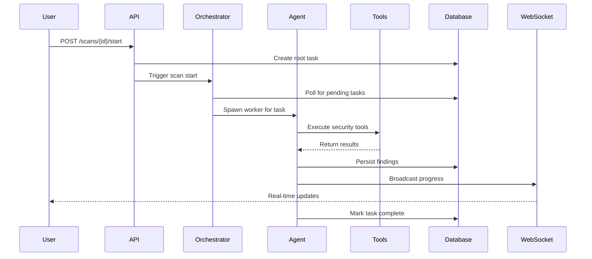

# Design Document

## Overview

The minimal working scan feature establishes the foundational end-to-end execution flow for Kodiak's autonomous penetration testing system. This design addresses critical architectural gaps that prevent scan execution, focusing on orchestrator lifecycle management, agent task execution, basic tool integration, and real-time progress reporting.

The core innovation is a robust task scheduling system where the Orchestrator acts as a "Swarm Kernel" that polls for pending tasks and spawns specialized agent workers, while maintaining state synchronization through database persistence and real-time WebSocket updates.

## Architecture

### High-Level Flow



### Component Responsibilities

**Orchestrator (Swarm Kernel)**
- Manages application lifecycle (start/stop scheduler loop)
- Polls database for pending tasks every 2 seconds
- Spawns and tracks agent workers
- Handles worker cleanup and error recovery
- Maintains registry of active workers by task ID

**Agent (Autonomous Worker)**
- Executes assigned tasks with LLM reasoning
- Manages tool inventory and validation
- Processes tool results and makes decisions
- Persists discoveries to knowledge graph
- Broadcasts progress via WebSocket events

**Tool System**
- Provides validated security testing capabilities
- Returns structured results with success/error status
- Tracks execution attempts to prevent duplication
- Supports both local and containerized execution

## Components and Interfaces

### Orchestrator Interface

```python
class Orchestrator:
    async def start() -> None
    async def stop() -> None
    async def start_scan(scan_id: UUID) -> None
    async def stop_scan(scan_id: UUID) -> None
    def get_available_tools() -> List[str]
    def validate_tool_exists(tool_name: str) -> bool
```

**Key Methods:**
- `start()`: Initializes scheduler loop and begins task polling
- `start_scan()`: Creates root task for scan and triggers orchestration
- `_scheduler_loop()`: Core polling mechanism that spawns workers
- `_worker_wrapper()`: Manages worker lifecycle and error handling

### Agent Interface

```python
class KodiakAgent:
    async def think(history: List[Dict], allowed_tools: List[str]) -> LLMResponse
    async def act(tool_name: str, args: Dict) -> ToolResult
    async def register_with_hive_mind() -> None
    def receive_message(content: str, sender: str) -> None
```

**Key Capabilities:**
- LLM-powered reasoning with tool selection
- Dynamic system prompt generation based on role
- Context injection from database (nodes, findings, attempts)
- Tool execution with proper error handling and event emission

### Tool Execution Interface

```python
class ToolResult:
    success: bool
    output: str
    data: Dict[str, Any]
    error: Optional[str]

class KodiakTool:
    async def run(args: Dict, context: Dict) -> ToolResult
    def to_openai_schema() -> Dict[str, Any]
```

**Supported Tools (Phase 1):**
- `terminal_execute`: System command execution
- `web_search`: OSINT and reconnaissance
- `proxy_request`: HTTP request manipulation
- Additional tools available but not required for MVP

### WebSocket Event Interface

```python
class EventManager:
    async def emit_scan_started(scan_id: str) -> None
    async def emit_tool_start(tool_name: str, target: str, agent_id: str) -> None
    async def emit_tool_complete(tool_name: str, result: ToolResult) -> None
    async def emit_finding_discovered(finding: Dict) -> None
    async def emit_scan_completed(scan_id: str, status: str) -> None
```

## Data Models

### Core Database Schema

```python
class Task(SQLModel, table=True):
    id: UUID
    project_id: UUID
    name: str
    status: str  # pending, running, completed, failed
    assigned_agent_id: str
    directive: str  # JSON string with task configuration
    result: Optional[str]
    created_at: datetime

class Attempt(SQLModel, table=True):
    id: UUID
    project_id: UUID
    tool: str
    target: str
    status: str  # success, failure, skipped
    reason: Optional[str]
    timestamp: datetime

class AgentLog(SQLModel, table=True):
    id: UUID
    scan_id: UUID
    agent_name: str
    step: str  # thinking, executing_tool, processing_result
    content: str
    timestamp: datetime
```

### Task Directive Format

```json
{
    "goal": "Conduct reconnaissance on target domain",
    "target": "example.com",
    "role": "scout",
    "skills": ["web_application_testing"],
    "constraints": {
        "max_iterations": 20,
        "timeout_minutes": 30
    }
}
```

## Correctness Properties

*A property is a characteristic or behavior that should hold true across all valid executions of a system-essentially, a formal statement about what the system should do. Properties serve as the bridge between human-readable specifications and machine-verifiable correctness guarantees.*

### Property Reflection

After analyzing the acceptance criteria, I identified several areas where properties can be consolidated:

- **Database persistence properties** (5.1-5.5) can be combined into comprehensive data integrity properties
- **WebSocket event properties** (6.1-6.5) can be unified into event broadcasting consistency properties  
- **Tool execution properties** (4.1-4.5) can be consolidated into tool execution reliability properties
- **Error handling properties** (7.1-7.5) can be combined into system resilience properties

The following properties provide unique validation value without redundancy:

### Property 1: Orchestrator Lifecycle Management
*For any* application startup sequence, the orchestrator should initialize successfully and begin polling for tasks, and during shutdown should gracefully cancel all active workers
**Validates: Requirements 1.1, 1.2**

### Property 2: Scan State Transitions
*For any* valid scan configuration, creating and starting a scan should result in proper state transitions (PENDING → RUNNING) and task creation
**Validates: Requirements 2.1, 2.2, 2.3**

### Property 3: Worker Spawning and Management
*For any* pending task in the database, the orchestrator should detect it within the polling interval and spawn an appropriate agent worker
**Validates: Requirements 2.4, 1.4**

### Property 4: Tool Execution Reliability
*For any* valid tool name and arguments, the system should execute the tool and return structured results with proper success/error status
**Validates: Requirements 4.1, 4.2, 4.4**

### Property 5: Tool Validation and Error Handling
*For any* invalid tool name or failed tool execution, the system should return appropriate error messages and prevent execution
**Validates: Requirements 3.2, 4.3**

### Property 6: Database Persistence Consistency
*For any* agent action (asset discovery, vulnerability finding, tool execution), the system should create corresponding database records with proper relationships
**Validates: Requirements 5.1, 5.2, 5.3, 5.4, 5.5**

### Property 7: Real-time Event Broadcasting
*For any* significant system event (scan start, tool execution, finding discovery), the system should broadcast appropriate WebSocket events to connected clients
**Validates: Requirements 6.1, 6.2, 6.3, 6.4, 6.5**

### Property 8: Task Completion and Cleanup
*For any* completed or failed task, the system should update task status, clean up worker resources, and handle scan termination properly
**Validates: Requirements 3.4, 3.5, 2.5, 1.5**

### Property 9: System Resilience Under Failure
*For any* system failure (LLM timeout, database error, tool crash), the system should handle the error gracefully with proper logging and recovery
**Validates: Requirements 7.1, 7.2, 7.3, 7.4, 7.5**

### Property 10: Configuration Validation
*For any* application startup, the system should validate required configuration (LLM provider, database connectivity) and provide clear error messages for missing requirements
**Validates: Requirements 8.1, 8.2, 8.3, 8.4, 8.5**

### Property 11: Attempt Deduplication
*For any* repeated tool execution with identical parameters on the same target, the system should track attempts and prevent infinite loops
**Validates: Requirements 4.5**

## Error Handling

### Orchestrator Error Recovery
- **Worker Crashes**: Mark task as failed, clean up resources, continue processing other tasks
- **Database Connectivity**: Retry with exponential backoff, degrade gracefully if persistent
- **Scheduler Loop Errors**: Log error, wait 5 seconds, restart loop

### Agent Error Handling
- **LLM API Failures**: Retry up to 3 times with exponential backoff (1s, 2s, 4s)
- **Tool Execution Timeouts**: Terminate process after 300 seconds, return timeout error
- **Invalid Tool Calls**: Return structured error, continue with next action

### Database Error Handling
- **Connection Failures**: Retry with backoff, continue with in-memory state if needed
- **Constraint Violations**: Log error, skip operation, continue processing
- **Transaction Failures**: Rollback, log error, retry once

### WebSocket Error Handling
- **Connection Drops**: Queue events, replay on reconnection
- **Broadcast Failures**: Log error, continue processing (non-blocking)
- **Client Disconnections**: Clean up subscriptions, continue operation

## Testing Strategy

### Dual Testing Approach
The system requires both unit tests and property-based tests for comprehensive coverage:

**Unit Tests** focus on:
- Specific API endpoint behavior
- Database model validation
- WebSocket connection handling
- Configuration validation edge cases
- Error message formatting

**Property-Based Tests** focus on:
- Orchestrator lifecycle across different configurations
- Scan state transitions with random valid inputs
- Tool execution reliability across tool types
- Database persistence consistency with various data
- Event broadcasting with different event types

### Property-Based Testing Configuration
- **Framework**: pytest with Hypothesis for Python property testing
- **Iterations**: Minimum 100 iterations per property test
- **Test Tags**: Each property test tagged with format: **Feature: minimal-working-scan, Property {number}: {property_text}**

### Integration Testing
- **End-to-End Scan Flow**: Create project → Create scan → Start scan → Verify agent execution → Check results
- **WebSocket Integration**: Connect client → Start scan → Verify real-time events → Disconnect gracefully
- **Database Integration**: Verify all models persist correctly with proper relationships
- **Tool Integration**: Execute each supported tool and verify structured output

### Testing Environment
- **Database**: PostgreSQL test instance with isolated schemas per test
- **LLM**: Mock LLM responses for deterministic testing
- **WebSocket**: Test client connections for event verification
- **Tools**: Mock tool execution for unit tests, real tools for integration tests