# Design Document: Production Readiness Suite

## Overview

The Production Readiness Suite transforms Kodiak from a development prototype into a production-ready open-source penetration testing platform. This comprehensive enhancement encompasses four critical areas: database migrations, advanced browser automation, production deployment configuration, and advanced reporting capabilities.

The design leverages Kodiak's existing multi-agent architecture, skills system, and tool framework while adding enterprise-grade features for community adoption and self-hosted deployments. The suite maintains Kodiak's core philosophy of intelligent coordination while adding the robustness required for production environments.

## Architecture

### High-Level Architecture

```mermaid
graph TB
    subgraph "Production Readiness Suite"
        subgraph "Database Layer"
            A[Alembic Migration System]
            B[Schema Versioning]
            C[Migration Validation]
        end
        
        subgraph "Browser Automation"
            D[Session Manager]
            E[Multi-Tab Controller]
            F[Resource Monitor]
            G[Evidence Collector]
        end
        
        subgraph "Deployment"
            H[Docker Compose]
            I[Kubernetes Manifests]
            J[Monitoring Stack]
            K[Security Hardening]
        end
        
        subgraph "Reporting System"
            L[Report Generator]
            M[Template Engine]
            N[Compliance Mapper]
            O[Export Formats]
        end
    end
    
    subgraph "Existing Kodiak Core"
        P[Multi-Agent System]
        Q[Hive Mind]
        R[Skills System]
        S[Tool Framework]
    end
    
    A --> P
    D --> Q
    L --> R
    H --> S
```



### Integration Points

The production readiness suite integrates with existing Kodiak components:

- **Database Migrations**: Extends the existing SQLModel/PostgreSQL setup with Alembic
- **Browser Automation**: Enhances the current Playwright integration with persistent sessions
- **Deployment**: Builds upon the existing Docker Compose setup with production hardening
- **Reporting**: Leverages the existing scan results and knowledge graph for comprehensive reports

## Components and Interfaces

### 1. Database Migration System

#### Migration Manager
```python
class MigrationManager:
    """Manages database schema evolution with Alembic integration"""
    
    async def check_pending_migrations(self) -> List[str]
    async def apply_migrations(self, target_revision: Optional[str] = None) -> MigrationResult
    async def rollback_migration(self, target_revision: str) -> MigrationResult
    async def validate_schema_integrity(self) -> ValidationResult
    async def get_migration_history(self) -> List[MigrationRecord]
```

#### Migration Lock System
```python
class MigrationLock:
    """Prevents concurrent migration execution across multiple instances"""
    
    async def acquire_lock(self, timeout: int = 300) -> bool
    async def release_lock(self) -> None
    async def is_locked(self) -> bool
```

**Design Rationale**: Uses PostgreSQL advisory locks to prevent concurrent migrations while maintaining compatibility with existing database connection patterns.

### 2. Advanced Browser Automation

#### Browser Session Manager
```python
class BrowserSessionManager:
    """Manages persistent browser contexts with multi-tab support"""
    
    async def create_session(self, config: SessionConfig) -> BrowserSession
    async def get_session(self, session_id: str) -> Optional[BrowserSession]
    async def cleanup_idle_sessions(self) -> int
    async def get_session_metrics(self) -> SessionMetrics
```

#### Multi-Tab Controller
```python
class MultiTabController:
    """Coordinates multiple browser tabs within a session"""
    
    async def open_tab(self, session_id: str, url: str) -> TabHandle
    async def switch_tab(self, session_id: str, tab_id: str) -> None
    async def close_tab(self, session_id: str, tab_id: str) -> None
    async def execute_cross_tab_action(self, session_id: str, action: CrossTabAction) -> ActionResult
```

#### Evidence Collection System
```python
class EvidenceCollector:
    """Captures comprehensive testing evidence"""
    
    async def capture_screenshot(self, tab_id: str) -> ScreenshotEvidence
    async def capture_network_traffic(self, session_id: str) -> NetworkEvidence
    async def capture_console_logs(self, tab_id: str) -> ConsoleEvidence
    async def capture_dom_state(self, tab_id: str) -> DOMEvidence
```

**Design Rationale**: Extends existing Playwright integration with persistent contexts stored in Redis for session state management. Resource monitoring prevents memory leaks from long-running browser sessions.

### 3. Production Deployment Configuration

#### Deployment Manager
```python
class DeploymentManager:
    """Manages deployment configurations and templates"""
    
    def generate_docker_compose(self, config: DeploymentConfig) -> str
    def generate_kubernetes_manifests(self, config: K8sConfig) -> Dict[str, str]
    def generate_monitoring_config(self, config: MonitoringConfig) -> Dict[str, str]
    def validate_deployment_config(self, config: DeploymentConfig) -> ValidationResult
```

#### Security Hardening
```python
class SecurityHardening:
    """Applies security configurations for production deployments"""
    
    def generate_tls_config(self, domain: str) -> TLSConfig
    def generate_firewall_rules(self, config: NetworkConfig) -> FirewallRules
    def generate_backup_scripts(self, config: BackupConfig) -> List[str]
    def validate_security_config(self, config: SecurityConfig) -> SecurityValidation
```

**Design Rationale**: Template-based approach allows customization while maintaining security best practices. Supports multiple deployment targets (Docker Compose, Kubernetes, bare metal) with consistent security posture.

### 4. Advanced Reporting System

#### Report Generator
```python
class ReportGenerator:
    """Generates comprehensive security reports in multiple formats"""
    
    async def generate_report(self, scan_id: str, template: ReportTemplate) -> Report
    async def generate_executive_summary(self, scan_id: str) -> ExecutiveSummary
    async def generate_technical_details(self, scan_id: str) -> TechnicalReport
    async def generate_compliance_mapping(self, scan_id: str, framework: str) -> ComplianceReport
```

#### Template Engine
```python
class ReportTemplateEngine:
    """Manages customizable report templates"""
    
    def load_template(self, template_name: str) -> ReportTemplate
    def customize_template(self, template: ReportTemplate, customizations: Dict) -> ReportTemplate
    def validate_template(self, template: ReportTemplate) -> ValidationResult
    def render_template(self, template: ReportTemplate, data: ReportData) -> str
```

#### Export System
```python
class ReportExporter:
    """Exports reports in multiple formats"""
    
    async def export_pdf(self, report: Report) -> bytes
    async def export_html(self, report: Report) -> str
    async def export_json(self, report: Report) -> Dict
    async def export_sarif(self, report: Report) -> Dict
    async def export_markdown(self, report: Report) -> str
```

**Design Rationale**: Modular template system allows complete customization while supporting industry-standard formats. Compliance mapping supports multiple frameworks (OWASP, NIST, CIS) for enterprise adoption.

## Data Models

### Migration Models
```python
class MigrationRecord(SQLModel, table=True):
    id: Optional[int] = Field(primary_key=True)
    revision: str = Field(index=True)
    applied_at: datetime
    applied_by: str
    execution_time: float
    status: MigrationStatus
    error_message: Optional[str] = None

class MigrationLock(SQLModel, table=True):
    id: Optional[int] = Field(primary_key=True)
    locked_at: datetime
    locked_by: str
    expires_at: datetime
```

### Browser Session Models
```python
class BrowserSession(SQLModel, table=True):
    id: str = Field(primary_key=True)
    project_id: int = Field(foreign_key="project.id")
    created_at: datetime
    last_activity: datetime
    config: SessionConfig
    status: SessionStatus
    resource_usage: ResourceMetrics

class BrowserTab(SQLModel, table=True):
    id: str = Field(primary_key=True)
    session_id: str = Field(foreign_key="browsersession.id")
    url: str
    title: Optional[str]
    created_at: datetime
    last_activity: datetime
    status: TabStatus

class EvidenceCapture(SQLModel, table=True):
    id: Optional[int] = Field(primary_key=True)
    session_id: str = Field(foreign_key="browsersession.id")
    tab_id: Optional[str] = Field(foreign_key="browsertab.id")
    evidence_type: EvidenceType
    file_path: str
    captured_at: datetime
    metadata: Dict[str, Any]
```

### Report Models
```python
class ReportTemplate(SQLModel, table=True):
    id: Optional[int] = Field(primary_key=True)
    name: str = Field(unique=True)
    description: str
    template_content: str
    output_format: ReportFormat
    created_at: datetime
    updated_at: datetime

class GeneratedReport(SQLModel, table=True):
    id: Optional[int] = Field(primary_key=True)
    scan_id: int = Field(foreign_key="scan.id")
    template_id: int = Field(foreign_key="reporttemplate.id")
    generated_at: datetime
    file_path: str
    file_size: int
    status: ReportStatus
```

**Design Rationale**: Extends existing Kodiak database schema with minimal changes. Uses foreign keys to maintain referential integrity with existing scan and project data.

## Correctness Properties

*A property is a characteristic or behavior that should hold true across all valid executions of a system-essentially, a formal statement about what the system should do. Properties serve as the bridge between human-readable specifications and machine-verifiable correctness guarantees.*

Now I'll analyze the acceptance criteria from the requirements to develop testable correctness properties.

### Property Reflection

After analyzing all acceptance criteria, I identified several areas where properties can be consolidated:

**Migration Properties**: Properties 1.1-1.7 cover different aspects of migration behavior and should remain separate as they test distinct functionality (startup detection, error handling, rollback, generation, validation, concurrency, auditing).

**Browser Session Properties**: Properties 2.1-2.8 cover session lifecycle, state management, and resource control - each provides unique validation value.

**Deployment Properties**: Mix of examples (documentation/configuration availability) and properties (behavioral requirements) - appropriately categorized.

**Reporting Properties**: Properties 4.1-4.10 cover different aspects of report generation and should remain separate.

**Resource Management Properties**: Properties 5.1-5.8 cover different aspects of resource control and session management.

**Security Properties**: Properties 6.1-6.8 cover different security aspects and should remain separate.

**Performance Properties**: Properties 7.1-7.8 cover different scaling and performance aspects.

**Integration Properties**: Mix of examples (documentation) and properties (behavioral requirements) - appropriately categorized.

All properties provide unique validation value and should be retained.

### Database Migration Properties

Property 1: Migration Auto-Detection and Application
*For any* system startup with pending migrations, the Migration_System should automatically detect and apply all pending migrations successfully
**Validates: Requirements 1.1**

Property 2: Migration Failure Rollback
*For any* migration that fails during execution, the system should rollback all changes and provide detailed error information with troubleshooting guidance
**Validates: Requirements 1.2**

Property 3: Bidirectional Migration Support
*For any* valid migration sequence, the system should support both forward migration and rollback to any previous schema version
**Validates: Requirements 1.3**

Property 4: Migration Generation with Dependencies
*For any* new migration creation, the system should generate migration files with proper dependency ordering and comprehensive documentation
**Validates: Requirements 1.4**

Property 5: Schema Integrity Validation
*For any* migration execution, the system should validate schema integrity both before and after the migration completes
**Validates: Requirements 1.5**

Property 6: Concurrent Migration Prevention
*For any* scenario with multiple system instances starting simultaneously, only one instance should execute migrations while others wait
**Validates: Requirements 1.6**

Property 7: Migration Audit Trail
*For any* migration execution, the system should maintain a complete audit trail with timestamps, version information, and execution details
**Validates: Requirements 1.7**

### Browser Automation Properties

Property 8: Persistent Browser Session State
*For any* browser session request, the system should create a persistent context that maintains state across multiple tool calls
**Validates: Requirements 2.1**

Property 9: Authentication Flow State Preservation
*For any* multi-step authentication flow, the browser session should preserve cookies, local storage, and session state between all steps
**Validates: Requirements 2.2**

Property 10: Multi-Tab Concurrent Support
*For any* browser session, the system should support multiple concurrent tabs for cross-tab vulnerability testing
**Validates: Requirements 2.3**

Property 11: Idle Session Cleanup
*For any* browser session that becomes idle, the system should automatically clean up resources after the configured timeout period
**Validates: Requirements 2.4**

Property 12: Browser Mode Support
*For any* browser automation scenario, the system should support both headless and headed modes with equivalent functionality
**Validates: Requirements 2.5**

Property 13: Dynamic Content Handling
*For any* single-page application testing, the system should wait for dynamic content loading and AJAX requests to complete
**Validates: Requirements 2.6**

Property 14: Comprehensive Evidence Capture
*For any* browser session, the system should capture screenshots, network requests, and console logs as evidence
**Validates: Requirements 2.7**

Property 15: Resource Limit Management
*For any* scenario where browser sessions exceed resource limits, the system should gracefully terminate oldest sessions and notify agents
**Validates: Requirements 2.8**

### Production Deployment Properties

Property 16: Kubernetes Horizontal Scaling
*For any* Kubernetes deployment, the system should support horizontal scaling of backend services with proper resource limits and health checks
**Validates: Requirements 3.2**

Property 17: Production Logging Configuration
*For any* production deployment, the system should provide comprehensive logging configuration for popular log aggregation systems
**Validates: Requirements 3.4**

Property 18: TLS Encryption Enforcement
*For any* production deployment, the system should enforce TLS encryption for external communications with Let's Encrypt integration
**Validates: Requirements 3.5**

Property 19: Encryption at Rest
*For any* sensitive data handling, the system should support encryption at rest with configurable key management
**Validates: Requirements 3.6**

Property 20: Zero-Downtime Deployments
*For any* system update deployment, the system should support zero-downtime rolling deployments with rollback procedures
**Validates: Requirements 3.8**

### Advanced Reporting Properties

Property 21: Multi-Format Report Generation
*For any* completed scan, the reporting system should generate comprehensive reports in all supported open formats (PDF, HTML, JSON, XML, Markdown)
**Validates: Requirements 4.1**

Property 22: Template Customization
*For any* report template, the system should support full customization with organization branding, logos, and styling through configuration files
**Validates: Requirements 4.2**

Property 23: Executive Summary Inclusion
*For any* generated report, the system should include executive summaries with risk metrics and open-standard compliance mappings
**Validates: Requirements 4.3**

Property 24: Technical Findings Detail
*For any* security report, the system should contain detailed technical findings with proof-of-concept code and community-sourced remediation steps
**Validates: Requirements 4.4**

Property 25: Evidence Inclusion with Sanitization
*For any* report where evidence exists, the system should include screenshots, network captures, and payload examples with proper sanitization
**Validates: Requirements 4.5**

Property 26: Compliance Framework Support
*For any* generated report, the system should support mapping to open compliance frameworks (OWASP Top 10, NIST Cybersecurity Framework, CIS Controls)
**Validates: Requirements 4.6**

Property 27: Trend Analysis Generation
*For any* scenario with multiple scans, the system should generate trend analysis and comparison reports with exportable data
**Validates: Requirements 4.7**

Property 28: Automated Report Delivery
*For any* scheduled report generation, the system should support automated delivery via email, webhooks, or file system
**Validates: Requirements 4.8**

Property 29: Report Versioning and Change Tracking
*For any* report with updated findings, the system should support versioning and change tracking with Git-like functionality
**Validates: Requirements 4.9**

Property 30: Integration API Availability
*For any* integration scenario, the reporting system should provide REST APIs for integration with open-source vulnerability management platforms
**Validates: Requirements 4.10**

### Session Management and Resource Control Properties

Property 31: Session Limit Enforcement
*For any* browser session creation, the session manager should enforce configurable limits on concurrent sessions per project
**Validates: Requirements 5.1**

Property 32: Resource Usage Monitoring
*For any* browser process, the system should monitor memory and CPU usage and terminate sessions exceeding configured thresholds
**Validates: Requirements 5.2**

Property 33: Idle Session Timeout
*For any* idle browser session, the session manager should implement configurable timeout policies with graceful cleanup
**Validates: Requirements 5.3**

Property 34: Real-Time Resource Metrics
*For any* system deployment, the resource controller should provide real-time metrics on browser session usage and system resources
**Validates: Requirements 5.4**

Property 35: Resource Prioritization
*For any* scenario with low system resources, the system should prioritize active sessions and queue new session requests
**Validates: Requirements 5.5**

Property 36: Session Persistence Across Restarts
*For any* system restart during long-running tests, the session manager should support session persistence
**Validates: Requirements 5.6**

Property 37: Session Crash Recovery
*For any* session crash, the system should automatically restart the session and restore previous state where possible
**Validates: Requirements 5.7**

Property 38: Container Orchestration Integration
*For any* container deployment, the resource controller should integrate with container orchestration for dynamic resource allocation
**Validates: Requirements 5.8**

### Security and Data Protection Properties

Property 39: API Access Control
*For any* production deployment, the system should secure API endpoints with configurable access controls (IP allowlists, API keys)
**Validates: Requirements 6.1**

Property 40: OWASP Security Compliance
*For any* sensitive data handling, the system should follow OWASP security guidelines and provide clear security configuration documentation
**Validates: Requirements 6.2**

Property 41: Comprehensive Audit Logging
*For any* security event, the security framework should provide comprehensive audit logging with configurable retention policies
**Validates: Requirements 6.3**

Property 42: Credential Encryption
*For any* stored LLM API keys and credentials, the system should use industry-standard encryption with secure key management
**Validates: Requirements 6.4**

Property 43: Compliance Framework Mapping
*For any* generated report, the compliance module should map findings to open security frameworks and standards
**Validates: Requirements 6.5**

Property 44: Data Retention Policy Enforcement
*For any* scan results and logs, the system should provide configurable data retention policies and enforce them
**Validates: Requirements 6.6**

Property 45: API Rate Limiting
*For any* API endpoint, the security controls should include configurable rate limiting with reasonable defaults
**Validates: Requirements 6.7**

Property 46: Data Sanitization and Secure Deletion
*For any* sensitive target data processing, the system should provide options for data sanitization and secure deletion
**Validates: Requirements 6.8**

### Performance and Scalability Properties

Property 47: Horizontal Scaling Support
*For any* stateless component, the system should support horizontal scaling with clear documentation for different deployment sizes
**Validates: Requirements 7.1**

Property 48: Database Read Replica Support
*For any* database configuration, the system should support read replicas and connection pooling with configuration examples for different scales
**Validates: Requirements 7.3**

Property 49: Large Scan Processing Efficiency
*For any* large scan processing, the system should implement efficient pagination and streaming with configurable limits
**Validates: Requirements 7.4**

Property 50: Built-in Performance Metrics
*For any* deployment, the performance monitor should provide built-in metrics and integration guides for popular monitoring solutions
**Validates: Requirements 7.5**

Property 51: Concurrent Operation Locking
*For any* concurrent operations, the system should implement proper locking and transaction management with clear documentation
**Validates: Requirements 7.6**

Property 52: Multi-Backend Caching Support
*For any* caching scenario, the caching layer should support multiple backends (Redis, in-memory) with configuration flexibility
**Validates: Requirements 7.7**

Property 53: Background Report Processing
*For any* report generation, the system should support background processing with progress tracking and resource management
**Validates: Requirements 7.8**

### Open-Source Integration Properties

Property 54: SIEM Integration Support
*For any* open-source SIEM system integration, the system should support standard log formats and provide integration guides
**Validates: Requirements 8.2**

Property 55: Plugin System Extensibility
*For any* custom tool or skill addition, the plugin system should allow additions through well-documented interfaces without core modifications
**Validates: Requirements 8.3**

Property 56: Vulnerability Scanner Integration
*For any* open-source vulnerability scanner connection, the system should import and correlate findings using standard formats
**Validates: Requirements 8.4**

Property 57: Webhook Notification Support
*For any* notification scenario, the webhook system should support real-time notifications with configurable payloads and community-contributed integrations
**Validates: Requirements 8.5**

Property 58: Open Standards Data Export
*For any* data export scenario, the system should support open standards (SARIF, STIX, CSV, JSON) for maximum tool interoperability
**Validates: Requirements 8.6**

Property 59: API Versioning and Backward Compatibility
*For any* API change, the API gateway should implement proper versioning and maintain backward compatibility for community integrations
**Validates: Requirements 8.7**

Property 60: Configuration-Driven Workflow Customization
*For any* workflow customization scenario, the system should provide configuration-driven behavior modification with extensive documentation and examples
**Validates: Requirements 8.8**

## Error Handling

### Migration Error Handling
- **Failed Migrations**: Automatic rollback with detailed error reporting and troubleshooting guidance
- **Concurrent Migration Attempts**: Advisory locking prevents conflicts with clear error messages
- **Schema Validation Failures**: Pre and post-migration validation with specific failure details
- **Dependency Resolution**: Clear error messages for missing dependencies or circular references

### Browser Session Error Handling
- **Session Creation Failures**: Graceful degradation with fallback to basic browser automation
- **Resource Exhaustion**: Automatic cleanup of oldest sessions with agent notification
- **Tab Crashes**: Automatic tab recovery with state restoration where possible
- **Network Failures**: Retry logic with exponential backoff for network operations

### Deployment Error Handling
- **Configuration Validation**: Comprehensive validation with specific error messages and suggestions
- **Resource Constraints**: Clear error messages when resource requirements cannot be met
- **Security Misconfigurations**: Validation errors with security best practice recommendations
- **Service Dependencies**: Health checks with detailed dependency status reporting

### Reporting Error Handling
- **Template Errors**: Validation with specific line numbers and correction suggestions
- **Data Export Failures**: Retry logic with alternative format fallbacks
- **Large Report Generation**: Memory management with streaming for large datasets
- **Integration Failures**: Detailed error reporting for external system integrations

## Testing Strategy

### Dual Testing Approach

The production readiness suite requires both unit testing and property-based testing to ensure comprehensive coverage:

**Unit Tests**: Focus on specific examples, edge cases, and integration points
- Migration script validation with known schema changes
- Browser session lifecycle with specific authentication flows
- Deployment configuration validation with known good/bad configs
- Report template rendering with specific data sets

**Property-Based Tests**: Verify universal properties across all inputs
- Migration operations with randomly generated schema changes
- Browser session management with various resource constraints
- Report generation with diverse scan result datasets
- Security controls with various attack scenarios

### Property-Based Testing Configuration

**Testing Framework**: pytest with Hypothesis for property-based testing
**Minimum Iterations**: 100 iterations per property test
**Test Tagging**: Each property test tagged with format: **Feature: production-readiness-suite, Property {number}: {property_text}**

### Testing Categories

**Database Migration Testing**:
- Unit tests for specific migration scenarios and rollback procedures
- Property tests for migration ordering, concurrency, and integrity validation
- Integration tests for multi-instance deployment scenarios

**Browser Automation Testing**:
- Unit tests for specific authentication flows and evidence capture
- Property tests for session management, resource limits, and cleanup
- Integration tests for multi-tab scenarios and cross-browser compatibility

**Deployment Configuration Testing**:
- Unit tests for specific deployment templates and security configurations
- Property tests for scaling behavior and resource management
- Integration tests for complete deployment scenarios

**Reporting System Testing**:
- Unit tests for specific report formats and template customizations
- Property tests for report generation with various data inputs
- Integration tests for external system integrations and API compatibility

### Test Data Management

**Migration Testing**: Use test databases with known schema states
**Browser Testing**: Use containerized test applications with known vulnerabilities
**Deployment Testing**: Use isolated test environments with controlled resources
**Reporting Testing**: Use synthetic scan data with known vulnerability patterns

The testing strategy ensures that all production readiness features work correctly across the wide variety of deployment scenarios and use cases expected in open-source community adoption.